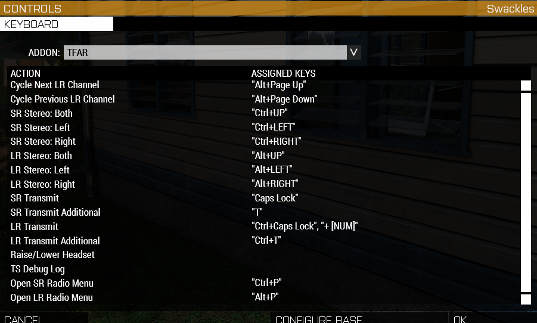

# How to setup TFAR

## Installing TS

1. Go to [teamspeak](https://teamspeak.com/en/downloads/#ts3client) and install TS3 client (You can skip signup)
2. Open up arma 3 launcher and navigate to the mods section. Once there right click on "Task Force Arrowhead Radio (BETA!!!)" and select "Open Folder". This will prompt you with a warning and just select "I understand"!
3. After that you should have an arma workshop folder open. In there search for go to "@Task Force Arrowhead Radio (BETA!!!)" folder and then "teamspeak"
4. Inside the teamspeak folder click on "task_force_radio.ts3_plugin" and it should propt you to install plugin, press install and restart your client afterwards.
5. Now setup your mic by going  tools -> options -> capture. Under there make sure you have the correct capture device and select "push-to-talk"
6. Next up in the same options window select addons and make sure Task Force Arrowhead Radio is installed

## Setup in-game

1. Launch Arma 3
2. In the menu go configure -> controls

3. Under show select "Multiplayer" and there search for "Push To Talk". Select that and delete the caps lock key or set it to another key and press ok
4. Then open the controls window back up, but this time click on the "CONFIGURE ADDONS" on the bottom right.
5. Select addon "TFAR", here you can change all of the TFAR keybinds, but for now we're interested in two "SR Transmit" and  "LR Transmit"

6. By default they should be caps-lock for SR and ctrl+caps-lock on LR, but feel free to change them into whatever you want.
7. Now grab a radio and you can start using them as you please

## Tutorial

There are two types of radios **LR**, which stands for Long Range and **SR**, which stands for short range. Usually LR radios are the ones you carry on your back (RED) and SR on your body (GREEN).

You can change the channel you're talking on by using the numpand on SR and ctrl+numpad on LR.
